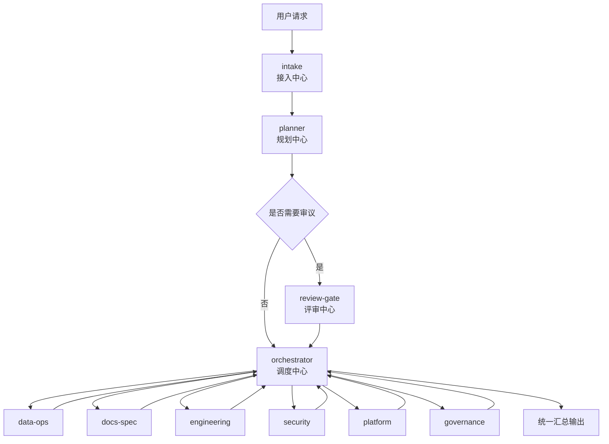

# 多 Agent 治理规则说明

## 1. 这是什么

`intake-governance` 不是“多开几个模型”的技巧，而是一套面向复杂任务的多 Agent 治理方法。

它把复杂工作拆成明确的角色链路，让任务按职责推进，而不是让多个 Agent 无约束并行。

仓库地址：

- GitHub: [awfaups/intake-governance](https://github.com/awfaups/intake-governance)

当前这套治理模型的标准链路是：

```text
intake -> planner -> review-gate? -> orchestrator -> worker(s) -> orchestrator
```

中文对应：

```text
接入中心 -> 规划中心 -> 评审中心? -> 调度中心 -> 执行部门 -> 调度中心
```

流程图：



它主要解决的是 5 件事：

- 谁先接任务
- 谁负责规划
- 谁负责审议
- 谁负责执行
- 谁负责最终统一收口

## 2. 现在这套 skill 包包含什么

当前仓库不只是一个 `SKILL.md`，而是一个完整的 skill 包：

- 根 skill：`SKILL.md`
- 5 个独立 workflow skill：
- `workflow-6a`：对应 `6A`
- `workflow-6ayh`：对应 `6AO`，目录名保留兼容标识
- `workflow-ppw`：对应 `PMW`，目录名保留兼容标识
- `workflow-sdd`：对应 `SDD`
- `workflow-generic-governance`：对应 `GGW`
- `references/`：治理规则、schema、路由、示例
- `scripts/`：校验与同步脚本
- `agents/openai.yaml`：展示名、短描述和默认提示入口

它不是应用程序，也不是 SDK，而是一套可挂载到 Agent Skills 环境里的治理规则包。

## 3. 核心角色说明

- `intake`：接入中心。负责接收请求、归一化意图、识别工作流、生成首张任务卡。
- `planner`：规划中心。负责拆解任务、比较方案、定义执行步骤和验收标准。
- `review-gate`：评审中心。负责质量与风险审查，决定批准、驳回或退回修订。
- `orchestrator`：调度中心。负责派发执行、跟踪回传、聚合结果、统一汇总。
- `worker(s)`：执行部门，负责各自领域内的落地执行。

当前执行部门固定为六组：

- `data-ops`：数据、成本、资源、报表
- `docs-spec`：文档、规格、报告
- `engineering`：代码实现、功能开发、缺陷修复
- `security`：安全、合规、审计
- `platform`：部署、CI/CD、工具链、自动化
- `governance`：Agent 注册、权限、训练、治理维护

注意点：

- worker 只能向 `orchestrator` 回传结果
- 不允许 worker 横向派单
- 不允许 worker 直接关闭任务

## 4. 入口规则为什么重要

当前仓库的明确规则是：

- `@intake` 是唯一允许的公开入口
- 外部请求不能直接进入 `planner`、`review-gate`、`orchestrator` 或任何 worker
- 别名只是 `intake` 拥有的快捷方式，不是绕过入口

允许的外部触发形式包括：

- `@intake`
- `@6A`
- `@6AO`
- `@PMW`
- `@SDD`
- `@GGW`
- `@init`
- `@plan`
- `@refactor`
- `@risk`
- `@decision`
- `@audit`
- `@ask`
- `@ppw`
- `@6AYH`
- `@PPW`
- `@sdd`

其中 `@6AYH`、`@PPW`、`@sdd` 是兼容旧别名；新文档和新提示词应优先使用 `@6AO`、`@PMW`、`@SDD`。

这些别名仍然必须先归一化回 `intake`，再进入内部治理链路。

这条规则的意义是：

- 避免角色越权
- 避免用户直接把任务跳给错误角色
- 避免规划、审议、执行混成一层
- 让 handoff 记录和责任边界可追踪

## 5. 工作流模式是怎么分的

`intake` 首先会把任务分类到以下规范工作流族之一：

| 规范名称 | 含义 | 内部 `workflow_mode` | 兼容旧别名 |
| --- | --- | --- | --- |
| `6A` | Align、Architect、Atomize、Approve、Automate、Assess | `6a` | 无 |
| `6AO` | 6A Optimization，基于 6A 延伸出的优化型工作流 | `6ayh` | `@6AYH` |
| `PMW` | Project Mapping Workflow，项目流程梳理型工作流 | `ppw` | `@ppw`、`@PPW` |
| `SDD` | Specification-Driven Development，规范驱动开发 | `sdd` | `@sdd` |
| `GGW` | Generic Governance Workflow，通用治理工作流 | `generic_governance` | 无 |

如果 `intake` 自动识别到 `6A`、`6AO`、`PMW`、`SDD` 或 `GGW`，它必须先输出该工作流要求的固定激活响应，再继续后续规划。

这意味着 workflow skill 不是公开入口，而是“工作流细节层”。

## 6. 为什么复杂任务适合多 Agent

适合进入这套治理模型的任务通常有这些特征：

- 任务复杂，不能一步完成
- 任务可以拆成多个阶段或多个子问题
- 任务跨多个领域，例如代码、文档、安全、部署
- 任务风险较高，需要独立审议
- 任务适合并行推进，但又需要统一收口

它的价值不是“更多 Agent”，而是：

- 分工明确
- 风险可控
- 责任清晰
- 可并行推进
- 可审计、可回退
- 降低返工

小任务通常不值得强行走多 Agent，例如：

- 修改一句文案
- 一个非常小的低风险 bug
- 简单翻译
- 单点配置改动

## 7. 单 Agent 与治理型多 Agent 的区别

两者的核心差别，不只是数量，而是有没有明确的角色、边界、审核和统一调度。

| 维度 | 单 Agent | 治理型多 Agent |
| --- | --- | --- |
| 工作方式 | 一个 agent 从头处理到尾 | 按角色链路协作 |
| 适合场景 | 简单、明确、低风险 | 复杂、跨域、高风险、可并行 |
| 任务拆解 | 依赖单个 agent 自己梳理 | 由 `planner` 负责拆解 |
| 风险控制 | 通常没有独立审核 | 可经过 `review-gate` |
| 并行能力 | 较弱 | 较强，但需统一调度 |
| 结果收口 | agent 直接输出 | `orchestrator` 统一汇总 |
| 管理成本 | 低 | 更高，但更适合复杂任务 |

一句话可以概括为：

- 小任务用单 Agent
- 大任务、跨域任务、高风险任务用治理型多 Agent

## 8. 文档门禁是这版仓库最重要的更新之一

当前仓库的关键门禁规则是：

- `6A`、`6AO`、`PMW`、`SDD`、`GGW` 都要求先输出 workflow 文档包
- 文档必须写在当前项目根目录下的 `docs/YYYY_MM_DD_中文任务名_vN/`
- 这些文档默认不能写回 skill 仓库，除非当前活动项目就是这个仓库
- 涉及代码修改时，文档必须记录：
  - 文件路径
  - 行号范围
  - 修改前上下文
  - 修改后上下文
- 在用户明确确认前，`user_confirmation.status` 必须保持为 `pending`
- 没有确认前，不得派发 `engineering`
- 没有确认前，不得生成或修改代码
- `review-gate` 通过不等于用户确认

这条规则的本质是：先把需求和改动边界文档化，再允许进入实现阶段。

## 9. 任务卡为什么是必需的

当前 skill 要求用结构化任务卡，而不是自由文本式委派。

至少需要这些字段：

- `task_id`
- `title`
- `from`
- `to`
- `goal`
- `brief`
- `tags`
- `constraints`
- `deliverables`
- `review_required`
- `workflow_mode`
- `current_stage`
- `required_documents`
- `document_status`
- `document_bundle_version`
- `user_confirmation`
- `code_change_targets`
- `handoff_history`
- `status`

这样做的目的是：

- 委派结构稳定
- handoff 可验证
- 状态迁移可审计
- 角色责任边界清楚

相关权威文件：

- [references/task-card.schema.json](references/task-card.schema.json)
- [references/handoff-record.schema.json](references/handoff-record.schema.json)
- [references/status-transitions.json](references/status-transitions.json)

## 10. 当前默认路由规则

`orchestrator` 按标签把任务路由到对应部门：

- `code`、`bugfix`、`feature`、`algorithm`、`performance` -> `engineering`
- `docs`、`api`、`report`、`spec` -> `docs-spec`
- `data`、`cost`、`reporting`、`resource` -> `data-ops`
- `security`、`compliance`、`audit` -> `security`
- `deploy`、`cicd`、`tooling`、`automation` -> `platform`
- `agent`、`permission`、`training`、`registry` -> `governance`

如果没有匹配的部门，任务应返回 `planner` 重新规划，而不是硬派给某个 worker。

## 11. 什么情况下必须经过 review-gate

以下情况应进入 `review-gate`：

- 任务高风险
- 任务跨多个执行部门
- 验收标准不清
- 涉及安全、合规、部署或权限

`review-gate` 的输出不能只说“通过”或“不通过”，还应包含：

- `rejection_reason`
- 必要时的 `required_fixes`

## 12. 这套规则能不能跨平台

可以。它本质上是可移植的治理规则，而不是绑定某个 IDE 的功能。

可移植的是：

- 角色定义
- 路由原则
- handoff 规则
- 任务卡结构
- 状态治理
- 文档门禁

但它不是“复制过去就自动运行”的产品特性。目标平台至少要支持：

- 多角色或多 Agent
- 任务分发
- 结果回传
- 状态留痕
- 最好有权限边界

## 13. 在 Claude Code / 类似平台里怎么理解

这套治理规则可以迁移到 Claude Code 或其他具备多 Agent 编排能力的平台，但需要平台适配。

常见映射方式：

- 主会话或 team lead 承担 `intake` / `orchestrator`
- 专门 agent 承担 `planner` / `review-gate`
- 各类 worker 做成独立 subagent 或 teammate

但要注意：

- 平台是否真的支持严格 handoff 约束，是另一回事
- 并不是“开多个 agent”就等于有治理
- 没有统一入口、统一调度、统一汇总，只能算多实例并行，不是治理型多 Agent

## 14. 当前仓库怎么维护最新状态

仓库已经内置了 3 个维护脚本：

- [scripts/validate_governance_skill.py](scripts/validate_governance_skill.py)
- [scripts/smoke_test_prompts.py](scripts/smoke_test_prompts.py)
- [scripts/sync_installed_skill.py](scripts/sync_installed_skill.py)

常用维护动作：

```bash
python3 scripts/validate_governance_skill.py
python3 scripts/validate_governance_skill.py --compare-installed
python3 scripts/sync_installed_skill.py
```

它们分别用于：

- 校验必需文件、JSON、YAML、示例结构和 smoke tests
- 对比仓库和已安装副本是否一致
- 把运行时相关文件同步到已安装 skill 副本

## 15. 当前仓库目录结构

```text
.
├── README.md
├── SKILL.md
├── OVERVIEW.md
├── OVERVIEW.zh-CN.md
├── BEGINNER_GUIDE.md
├── BEGINNER_GUIDE.zh-CN.md
├── PUBLISHING.md
├── LICENSE
├── agents
│   └── openai.yaml
├── scripts
│   ├── smoke_test_prompts.py
│   ├── sync_installed_skill.py
│   └── validate_governance_skill.py
├── skills
│   ├── workflow-6a
│   ├── workflow-6ayh
│   ├── workflow-generic-governance
│   ├── workflow-ppw
│   └── workflow-sdd
└── references
    ├── agents.json
    ├── engineering-governance.md
    ├── handoff-record.schema.json
    ├── intake-classification.md
    ├── role-permissions.md
    ├── role-prompts.json
    ├── routing-rules.json
    ├── status-transitions.json
    ├── task-card.schema.json
    ├── templates
    │   └── 01_SPEC.template.md
    ├── workflow-naming.md
    ├── workflow-routing.json
    └── workflows
        ├── 6a.md
        ├── 6ayh.md
        ├── generic-governance.md
        ├── ppw.md
        └── sdd.md
```

## 16. 对内分享时推荐的结论

建议把这套多 Agent 模型定义为“任务治理方法”，而不是“多开几个模型”。

对内可以直接用这段话：

> 多 Agent 的核心不是多开几个模型，而是通过 `intake` 统一接入、`planner` 规划拆解、`review-gate` 风险审议、`orchestrator` 调度汇总，以及不同 worker 按职责执行，来提升复杂任务的稳定性、并行能力和可治理性。`intake-governance` 这版仓库还进一步加入了 workflow 文档门禁、结构化任务卡、schema 校验和独立 workflow skills，使这套规则更适合在真实工程环境里落地和维护。
