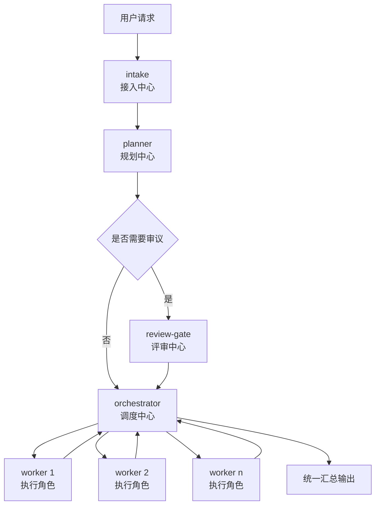
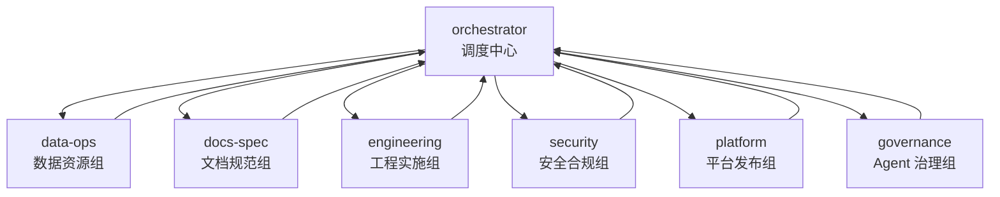
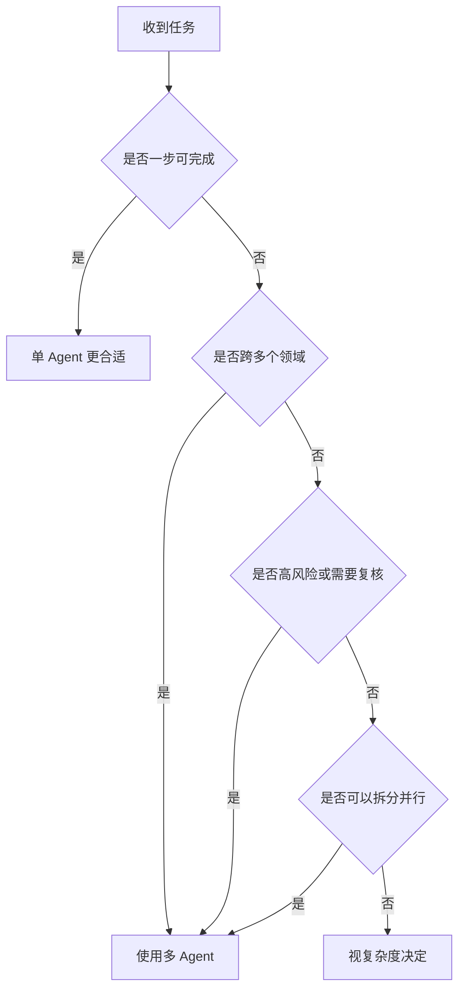

# 多 Agent 治理规则说明

## 1. 这是什么

这套多 Agent 规则，本质上不是“多开几个模型”，而是给复杂任务加上一层治理流程，让任务按角色分工推进。

仓库地址：

- GitHub: [awfaups/intake-governance](https://github.com/awfaups/intake-governance)

标准链路是：

```text
intake -> planner -> review-gate? -> orchestrator -> worker(s) -> orchestrator
```

中文对应：

```text
接入中心 -> 规划中心 -> 评审中心? -> 调度中心 -> 执行角色(六部) -> 调度中心
```

流程图：



它解决的是 5 件事：

- 谁先接任务
- 谁负责规划
- 谁负责审核
- 谁负责执行
- 谁负责统一汇总

## 2. 角色说明

- `intake`：接入中心。负责接收请求、识别任务类型、生成任务卡。
- `planner`：规划中心。负责拆解任务、设计方案、定义执行顺序和验收标准。
- `review-gate`：评审中心。负责风险审查、质量把关、决定是否放行。
- `orchestrator`：调度中心。负责派单、协调、跟踪进度、统一收口。
- `worker(s)`：执行角色，也叫“六部”，负责具体落地执行。

六部通常是：

- `data-ops`：数据资源组，负责数据、成本、资源评估、报表。
- `docs-spec`：文档规范组，负责文档、规范、报告、规格输出。
- `engineering`：工程实施组，负责代码实现、功能开发、Bug 修复、测试支持。
- `security`：安全合规组，负责安全、合规、审计、风险扫描。
- `platform`：平台发布组，负责部署、CI/CD、工具链、自动化。
- `governance`：Agent 治理组，负责 Agent 注册、权限、培训、治理维护。

角色与执行部门关系图：



## 3. 为什么要用多 Agent

适合多 Agent 的任务通常具备这些特征：

- 任务复杂，不能一步做完
- 任务能拆成多个子任务
- 任务跨多个领域，比如代码、文档、测试、安全、部署
- 任务风险高，需要复核
- 任务适合并行推进

它的价值不是“更多 agent”，而是：

- 分工清楚
- 风险可控
- 可并行
- 可追踪
- 可回退
- 减少返工

小任务通常不值得上多 Agent，比如改一句文案、修一个小 bug、简单翻译或小配置修改。

适用场景判断图：



## 4. 单 Agent 与多 Agent 对比

两者的差别，不只是“一个还是多个”，而是有没有明确的角色分工、审核链路和统一调度。

| 维度 | 单 Agent | 多 Agent |
| --- | --- | --- |
| 工作方式 | 一个 agent 从头处理到尾 | 多个角色按链路协作 |
| 适合场景 | 简单、明确、低风险任务 | 复杂、跨域、高风险、可并行任务 |
| 任务拆解 | 依赖单个 agent 自己梳理 | 由 `planner` 明确拆解 |
| 风险控制 | 通常没有独立审核 | 可通过 `review-gate` 做风险把关 |
| 并行能力 | 较弱 | 较强，可按子任务并行 |
| 结果汇总 | agent 直接输出 | 由 `orchestrator` 统一收口 |
| 管理成本 | 低 | 较高，但适合复杂任务 |

简单判断可以记成一句话：

- 小任务用单 Agent
- 大任务、跨领域任务、高风险任务用多 Agent

## 5. 多 Agent 是怎么“创建 Agent”的

这里的“创建”更准确地说，是“先定义角色，再按任务动态派发”。

流程一般是：

1. `intake` 先接外部请求并分类
2. `planner` 判断需要哪些角色参与
3. `review-gate` 在高风险场景下决定是否放行
4. `orchestrator` 根据任务标签把任务派给合适的 worker
5. worker 执行后统一回传给 `orchestrator`

所以它不是每次临时凭空造出一个新 Agent，而是从一套已注册的角色体系里，按需调用对应角色参与任务。

## 6. 为什么要做 Agent 注册

`Agent 注册` 不是为了“发账号”，而是为了建立治理基础。

它的目的包括：

- 明确系统里有哪些角色
- 明确每个角色能做什么、不能做什么
- 明确任务能从谁流向谁
- 让调度规则可执行
- 让 handoff 和责任追踪有依据

没有注册信息，就很难做权限控制、路由分发和统一治理。

## 7. 不同角色能否用不同模型

可以，但要分两层看。

- 这套治理规则本身不限制模型选择，它主要管角色、权限、路由和 handoff。
- 真正是否支持“不同角色使用不同大模型”，取决于底层平台。

在 OpenAI / Codex 能力层面，这种做法是可行的。常见策略是：

- `intake` / `planner` / `review-gate` / `orchestrator`：用更强模型
- `docs-spec` / `data-ops` / 简单检索型 worker：用更快更便宜的小模型
- `engineering` / `security` / 高风险决策：优先用更强模型

结论是：治理层允许，平台层决定怎么配。

## 8. 它和 IDE 里“开多个 Agent”有什么区别

两者不是一回事。

- 这里的多 Agent：是有角色、有边界、有流转规则的协作体系。
- IDE 里手动开多个 Agent：通常只是多个独立实例并行工作。

最关键的区别是：

- 这里强调统一入口、统一调度、统一汇总
- IDE 并行 agent 更像多个独立助手，协调和审议通常靠人手动完成

一句话说：

- 治理型多 Agent = 有组织的团队协作
- IDE 多 Agent = 多个并行工作单元

## 9. 这套规则能不能跨平台

可以。它本质上是可移植的治理规则，不只限于 Codex。

可移植的是这些内容：

- 角色定义
- 任务卡结构
- handoff 规则
- 审核规则
- 路由原则
- 状态流转

但它不是“拷过去自动运行”的产品功能。要落地到别的平台，平台本身至少要支持：

- 多角色或多 agent
- 任务分发
- 结果回传
- 状态留痕
- 最好有权限边界

## 10. 在 Claude Code 中如何使用

在 Claude Code 中可以使用这套治理规则，但要做适配。

落地方式通常有两种：

- 用 `subagents` 做轻量版本
- 用 `agent teams` 做更接近完整治理链路的版本

映射关系一般是：

- 主会话或 team lead 承担 `intake` / `orchestrator`
- 专门 agent 承担 `planner` / `review-gate`
- 各类 worker 做成独立 subagent 或 teammate

限制也要明确：

- Claude Code 的 subagent 更适合主控派发后回传结果，不适合完整复刻复杂治理图
- `agent teams` 更接近完整多 Agent 编排，但属于实验性能力，通常需要额外启用

结论是：可以迁移，但不是原样照搬。

## 11. 推荐对内结论

建议把这套多 Agent 理解成一套“任务治理方法”，而不是某个 IDE 的专属功能。

适合的对内表述可以直接用这段：

> 多 Agent 的核心不是多开几个模型，而是通过 `intake` 统一接入、`planner` 规划拆解、`review-gate` 风险审议、`orchestrator` 调度汇总，以及不同 worker 分工执行，来提升复杂任务的稳定性、并行能力和可治理性。它可以运行在 Codex 中，也可以迁移到其他支持多 Agent 编排的平台，但需要结合平台能力做适配。
